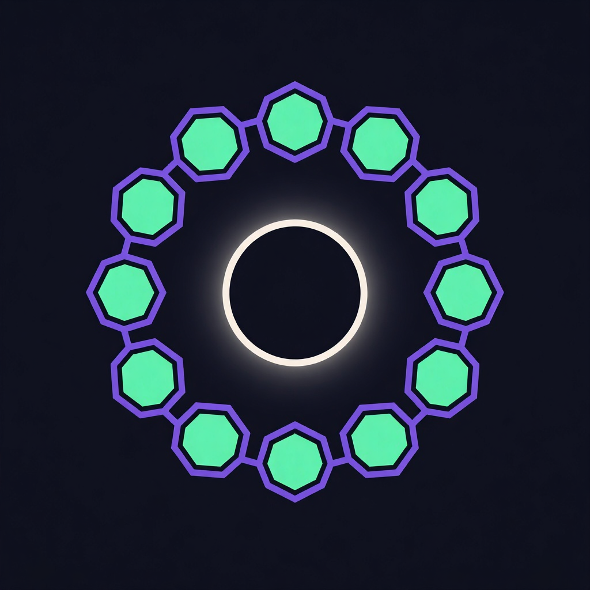
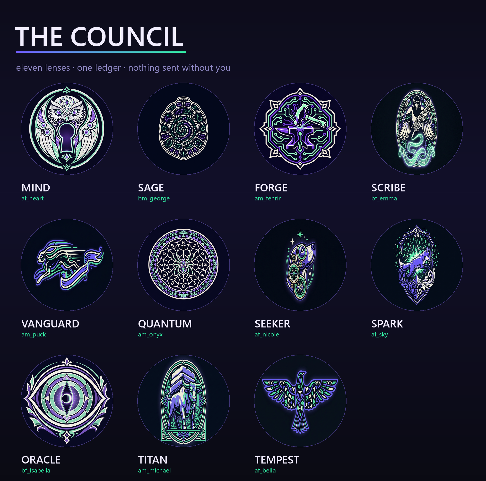

<div align="center">



# The Council

### Eleven sigils, eleven cards, one sheet.



</div>

---

## Regenerate

```bash
python apps/cards/build.py            # skips what already exists
python apps/cards/build.py --force    # regenerate emblems (costs money)
python apps/cards/build.py --only Sage
```

Eleven emblems + the sheet took **3.1 minutes** and a few cents.

---

## Why the card text is not generated

Image models cannot render reliable text. Ask one for *"a card reading QUANTUM, voice
am_onyx"* and you get confident gibberish — `QUANTVM`, `an_0nyx`. **A card whose facts are
wrong is worse than no card.**

So the work is split: the **model draws the sigil**, and **Pillow lays the text over it**. Every
string on a finished card is read from the framework's own tables — `voice.VOICES` for the
speaker, `pets.PETS` for the runner, `pets.stats()` for the tier.

Which means **a card cannot disagree with the code it describes.** Change a counselor's voice
in `voice.py` and the next card render says so. The errand count on the card is read from the
hash-chained ledger, so it isn't a nice number someone typed — it's the same number
`mindbot pets` prints.

## Prompt shape that worked

`OBJECT + MATERIAL + ONE VERB`, then a fixed style block:

```
"an ancient tortoise shell inscribed with a spiral of tiny constellations"
+ flat vector emblem, dark navy-black field, violet #6E5BFF / mint #32E6A0 / bone,
  thick clean linework, heraldic, symmetrical, NO TEXT NO LETTERS NO WORDS
```

Adjective piles get averaged into mush. One concrete object and one verb survives the
round-trip. `NO TEXT` in caps three ways because these models love to add a garbled banner.

## Which model drew what

Requested `openai/gpt-image-2` first. It returned:

```
HTTP 400 — {"error":{"message":"Billing hard limit has been reached.",
            "metadata":{"provider_name":"OpenAI"}}}
```

That's OpenAI's own limit upstream at OpenRouter — nothing to do with your key, and nothing you
can configure around. The fallback chain in `imagery.py` walked on:

| Model | Drew |
|---|---|
| `openai/gpt-image-2` | — (400, provider limit) |
| `microsoft/mai-image-2.5-pro` | Mind, Sage, Forge, Quantum, Oracle, logo |
| `google/gemini-3.1-flash-image` | Scribe, Vanguard, Seeker, Spark, Titan, Tempest |

**This is the reason the fallback list exists.** A 13-image batch that dies on image two because
one provider is rate-limited is a batch you run manually forever. Add a model to
`imagery.FALLBACKS` in preference order; if it uses the dedicated `/api/v1/images` endpoint,
add it to `_DEDICATED` too — the two shapes return the payload differently and picking the wrong
one is why a working model looks broken.

<div align="center">

<sub>Built with <a href="https://github.com/TheMindExpansionNetwork/mindbot-framework">MindBot</a></sub>

### Prove, don't promise.

</div>
