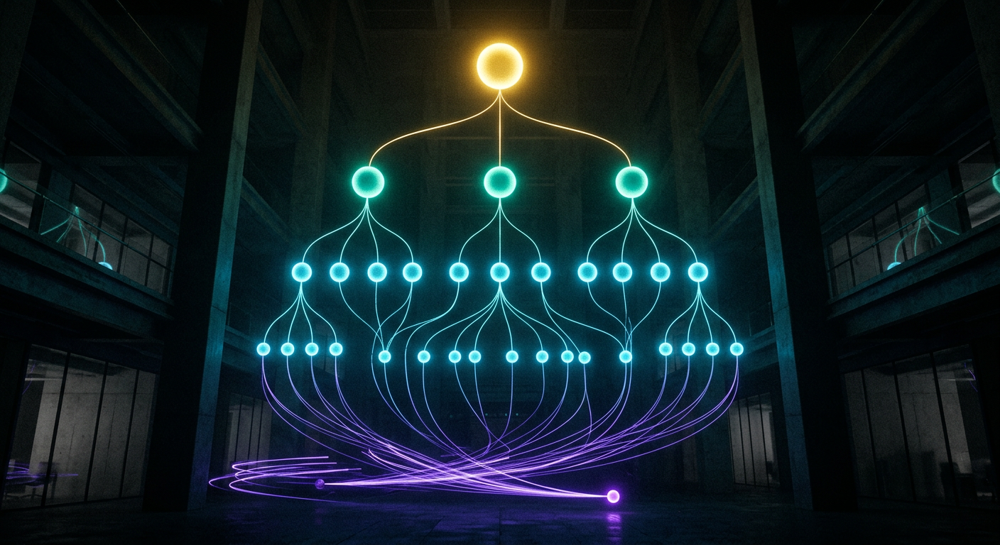

# Case Study — THE FIRM: a hierarchical multi-model swarm

*Run live 2026-07-25 on real models via OpenRouter. Every number below is measured, not modeled.*



## The thesis

Every "AI swarm" on the market is **flat**: N copies of one model, all doing the same thing.
That is not how organizations work, and it is not how you'd spend money if you thought about it
for ten seconds. Real work has **ranks** — someone decides, someone decomposes, someone
executes, someone cleans up — and those jobs need *different* capabilities at *different* prices.

**THE FIRM maps each rank onto a different model.**

| Rank | Model | Why | Calls |
|---|---|---|---|
| **Orchestrator** | `anthropic/claude-opus-5` | deepest judgment (most expensive) | **1** |
| **Manager** | `openai/gpt-5.6-sol` | strong reasoning, decomposition | **3** |
| **Worker** | `openai/gpt-5.6-terra` | balanced + fast, does the volume | **6** |
| **Janitor** | `openai/gpt-5.6-luna` | cheapest capable, QA/cleanup | **1** |

## The measured run

**Goal:** *"Produce the complete go-to-market package to launch MindBot — an autonomous 11-mind
AI council you install in one command — on August 11, targeting solo builders and 50-seat
companies currently renting AI per seat."*

```
✓ done — 11 calls in 71.1s

  RANK           CALLS       COST   SHARE
  Orchestrator       1   $0.00161    2.7%
  Manager            3   $0.00686   11.7%
  Worker             6   $0.03466   58.8%
  Janitor            1   $0.01577   26.8%

  total $0.05891  ·  same work all-on-claude-opus-5: $0.13398
  saved $0.07506 (56.0%) vs a flat swarm
```

### What that proves

1. **The cost pyramid is real.** The most expensive model carries **2.7%** of spend while making
   the decision that shapes everything. The volume (6 of 11 calls) rides a mid-priced model.
2. **56% cheaper than a flat swarm** doing identical work — and the gap *widens* as the tree
   grows, because scaling adds workers (cheap), not orchestrators (expensive).
3. **71 seconds, wall clock.** Managers fan out in parallel; each manager's workers fan out
   again. The tree widens exactly where the work is independent.
4. **Quality held.** The deliverable (in `outbox/`) is a real GTM package: core narrative,
   segment positioning statements, and a shot-by-shot demo script. Sample:

   > *"Per-seat AI pricing was always a landlord's game — charge you monthly for access to
   > intelligence you never own... **MindBot breaks the lease.**"*

## Why this is better than everything else

| | Flat swarm (everyone else) | THE FIRM |
|---|---|---|
| Models | 1, cloned N times | **4, one per rank** |
| Cost shape | rectangle — every call at top price | **pyramid — 2.7% at the top** |
| Cost, this run | $0.134 | **$0.059 (−56%)** |
| Judgment vs grunt work | same model does both | **matched to rank** |
| Scaling | linear at the *highest* price | widens at the *cheapest* rank |
| Auditability | one blob of output | **every rank's output captured** |

## Run it

```bash
mindbot firm "your goal" --divisions 3 --tasks 2
```
- Workers = `divisions × tasks`. Total calls = `1 + divisions + (divisions×tasks) + 1`.
- Full run record (every call, every cost) → `framework/firm_runs/*.json`
- The deliverable → `framework/outbox/*_FIRM_*.md`
- Constitution unchanged: **drafts only**, nothing sends or charges.

## Implementation notes for the next agent
- `mindbot_pipeline/firm.py` — the whole pyramid is **data** (`RANKS`), not code. Change a
  rank's model there, or pass `models={"worker": {"model": "..."}}` at call time.
- `report()` computes the counterfactual (`flat_swarm_cost`) by re-pricing every call at the
  orchestrator's rate — that's where the "% saved" claim comes from.
- Tests (`tests/test_firm.py`) assert the pyramid **shape** (1/N/N×M/1), that each rank uses its
  own distinct model, and that the flat-swarm counterfactual always costs more. Fully mocked —
  no network, no spend.
